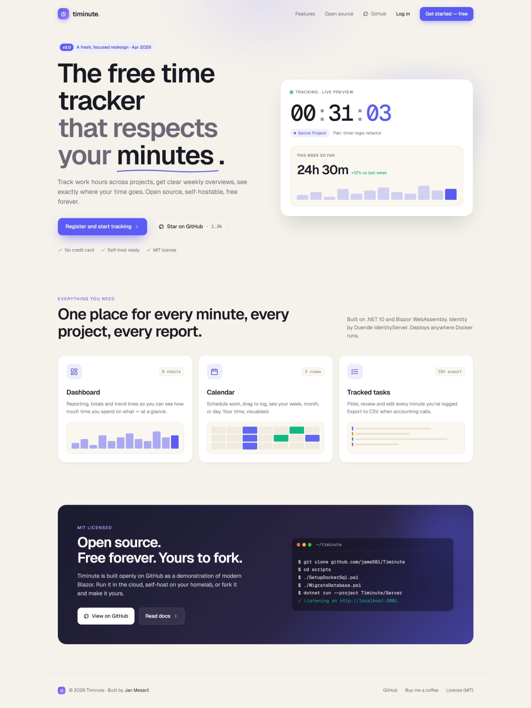
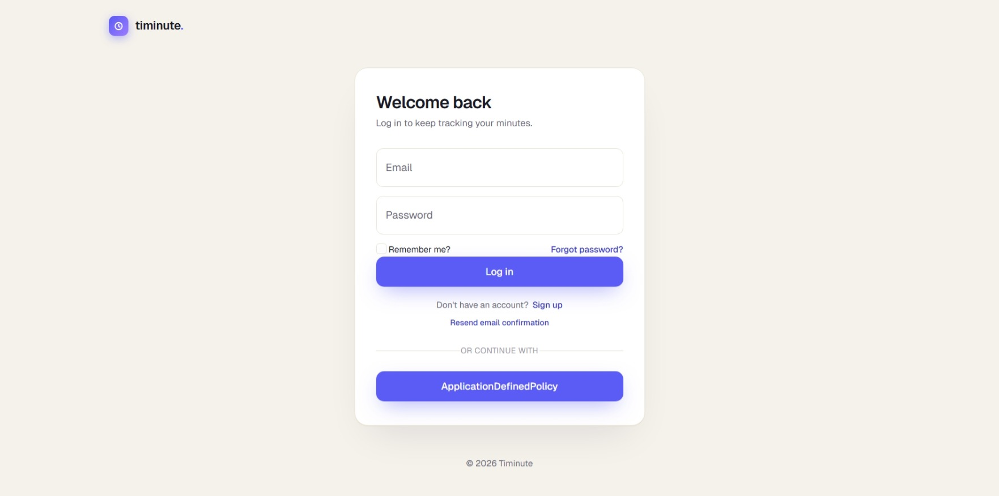
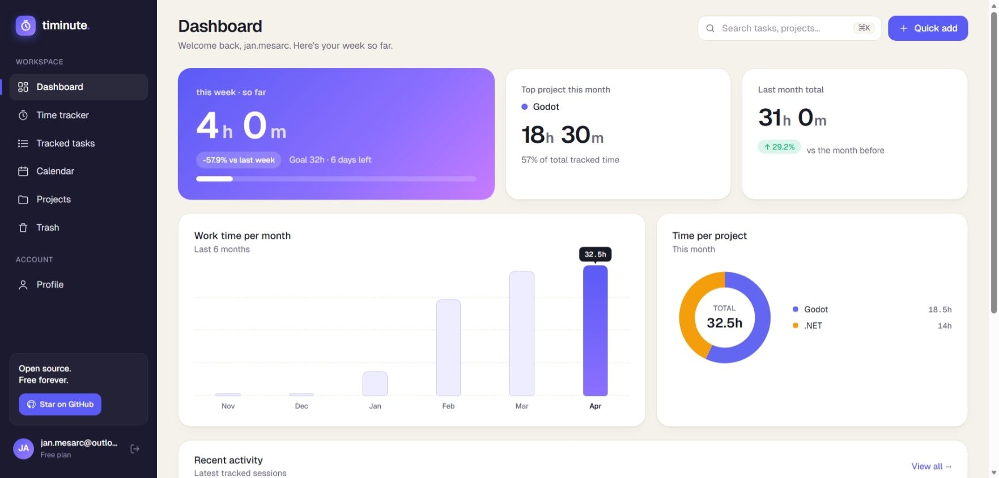
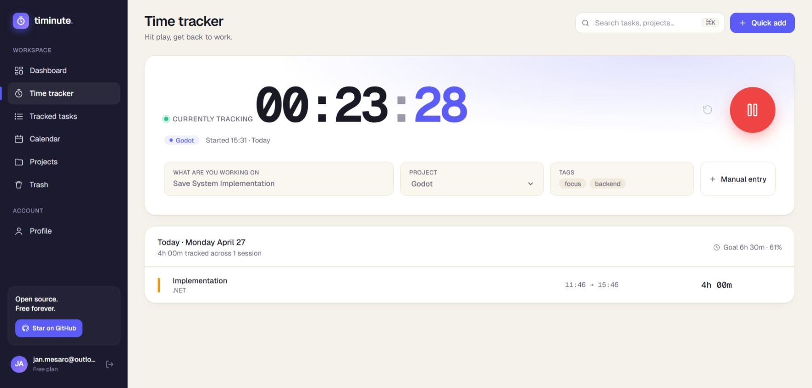
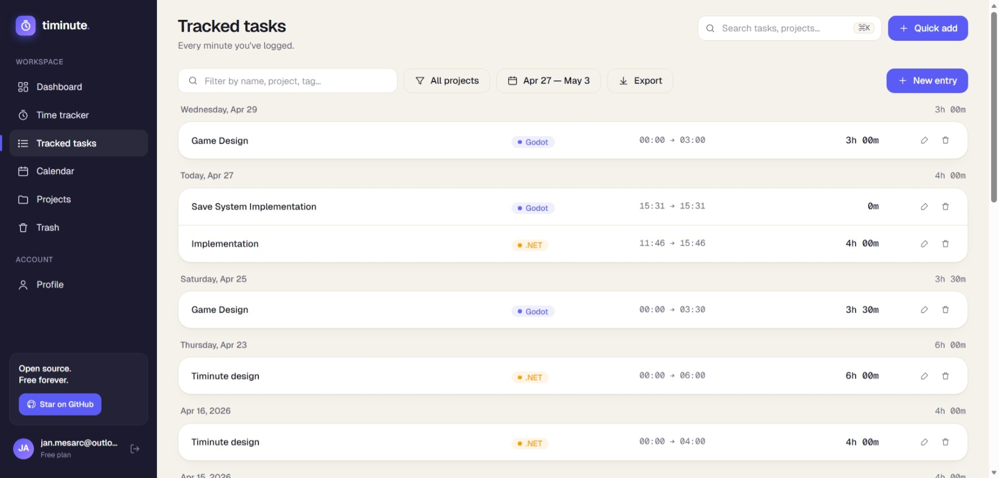
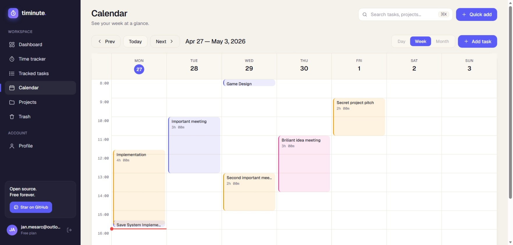
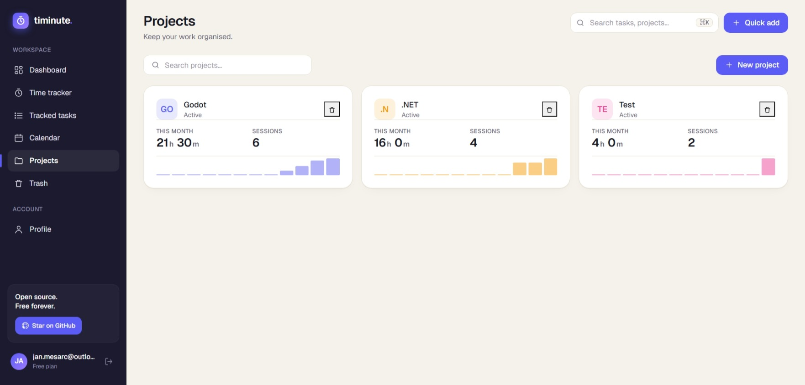

# Timinute

[](https://github.com/jame581/Timinute/actions/workflows/release.yml)
[](https://github.com/jame581/Timinute/releases/latest)
[](LICENSE)
[](https://dotnet.microsoft.com/)

The free, open-source time tracker that respects your minutes. Track work hours across projects, see exactly where your time goes, and get clear weekly overviews — all in a self-hostable Blazor WebAssembly app.

Originally a demo of modern Blazor; now fully redesigned around the **Aurora** visual system (v2.1) with a tokenized design system, hand-built SVG charts, a custom calendar, full mobile-responsive treatment, and a no-flash dark mode that follows your system or your preference.

## Highlights

- **Time tracker** with a real-time stopwatch, session-storage persistence across reload, and undo on delete.
- **Calendar** — desktop week view with a current-time line, mobile day view with a 7-day strip selector. Click an empty cell to add, click an event to edit.
- **Projects** with user-picked colors, monthly stats, and per-project sparklines.
- **Dashboard** — gradient hero stat card, top-project + last-month tiles, hand-built SVG bar chart and donut, recent activity list.
- **Trash** — 30-day soft-delete recovery for projects and tasks, cascade-restore on Project, background hard-purge service.
- **Search + filter** — `TrackedTask/search` (date range, project, name, task-count) and `Project/search` (name, min-task-count).
- **Data export** — CSV and Excel exports for tasks, project summaries, and monthly analytics.
- **Identity** — Duende IdentityServer for auth (JWT for the API, cookie for Identity UI), Basic/Admin roles, lockout, registration via Razor Pages.
- **Mobile responsive** — bottom glass tab bar with FAB, slide-up overflow sheet, full reflow at ≤768px.
- **Dark mode** — `Light / Dark / System` preference, no flash on reload (synchronous pre-Blazor bootstrap), watches `prefers-color-scheme` for System users. Quick toggle in the desktop topbar.
- **User preferences** — configurable weekly goal and workday-hours target persisted server-side per user; the Dashboard hero card consumes both for weekly progress and a "Today X.Xh / Yh target" indicator.
- **Accessibility** — `prefers-reduced-motion` honored, `aria-current` on active nav, focus-visible outlines, modal sheet semantics.

## Screenshots

### Landing


### Login


### Dashboard


### Time tracker


### Tracked tasks


### Calendar


### Projects


## Tech stack

.NET 10 · Blazor WebAssembly (hosted) · EF Core 10 · SQL Server · Duende IdentityServer · Radzen.Blazor (dialogs/notifications only — design system is custom Aurora) · xUnit + Moq + EF InMemory.

## Prerequisites

- [Visual Studio 2022 (17.x or newer)](https://visualstudio.microsoft.com/) or another .NET 10 IDE
- [.NET 10 SDK](https://dotnet.microsoft.com/download/dotnet)
- [Docker Desktop](https://www.docker.com/get-started) — used for the local SQL Server 2025 container

## Getting Started

```powershell
# 1. clone
git clone https://github.com/jame581/Timinute.git
cd Timinute

# 2. start a local SQL Server 2025 container on port 44555
.\scripts\SetupDockerSql.ps1

# 3. apply EF Core migrations
.\scripts\MigrateDatabase.ps1

# 4. run the app (server hosts the WASM client)
dotnet run --project Timinute/Server/Timinute.Server.csproj
```

Default URLs: <https://localhost:7047> / <http://localhost:5047>. Swagger lives at `/swagger`.

Seeded test users (passwords are intentionally trivial — local dev only):

| Email | Role |
|---|---|
| test1@email.com | Basic |
| test2@email.com | Basic |
| test3@email.com | Basic |

## Production deployment

The defaults in `appsettings.json` are tuned for local development on `https://localhost:7047`. For any non-local deployment you'll want to override at least these three:

**1. IdentityServer authority** — JWT issuer + OIDC discovery endpoint. If left at the localhost default, tokens issued by your deployed instance will be rejected at validation. Override via env var:

```bash
IdentityServer__Authority=https://timinute.example.com
```

…or in `appsettings.Production.json`:

```json
{
  "IdentityServer": { "Authority": "https://timinute.example.com" }
}
```

**2. Connection string** — `appsettings.json` ships with the local Docker SA password so `dotnet run` works out of the box. Override for production:

```bash
ConnectionStrings__DefaultConnection="Server=...;Database=Timinute;User Id=...;Password=...;TrustServerCertificate=True;Encrypt=True"
```

**3. Persistent `/keys` directory** — Duende IdentityServer uses automatic key management in production and writes rotating signing keys to `/keys`. On ephemeral hosts (Docker without a volume mount, App Service slot swaps, scaled-out replicas) this directory disappears or differs per instance, which invalidates JWTs after restart and breaks load balancing. Mount a persistent volume at the container's `/keys` (or override the path via `IdentityServer:KeyManagement:KeyPath` if your hosting prefers a different location).

For Docker:

```bash
docker run -v timinute-keys:/keys ...
```

> **v2.0 migration note:** the migration from IdentityServer4 to Duende dropped the IS4-era `DeviceCodes` / `Keys` / `PersistedGrants` tables. If you're upgrading a database that contained any IS4 grant data, that data is lost — log all users out and have them re-authenticate post-deploy.

> **v2.1 migration note:** `AddUserPreferences` adds three columns to `AspNetUsers` (`Preferences_Theme nvarchar(8)`, `Preferences_WeeklyGoalHours decimal(4,1)`, `Preferences_WorkdayHoursPerDay decimal(4,1)`) with sensible defaults applied to existing rows in one statement. No data loss, no separate UPDATE pass.

## Project layout

```
Timinute/
  Server/         ASP.NET Core Web API + Identity + IdentityServer
  Client/         Blazor WebAssembly SPA (Aurora design system)
  Shared/         DTOs shared between client and server
  Server.Tests/   xUnit + Moq + EF InMemory
docs/superpowers/
  specs/          Per-feature design specs
  plans/          Active plans
  plans/done/     Shipped plans, kept for history
```

## Roadmap

See [`docs/superpowers/plans/feature-roadmap.md`](docs/superpowers/plans/feature-roadmap.md) for the current feature set, P1/P2 backlog, and tech-debt list. Active design specs live alongside in `docs/superpowers/specs/`.

## Author

**Jan Mesarč** — *Creator* — [jame581](https://github.com/jame581)

If Timinute is useful to you, [Buy Me A Coffee](https://www.buymeacoffee.com/jame581) ☕.

## License

MIT — see [LICENSE](LICENSE).
